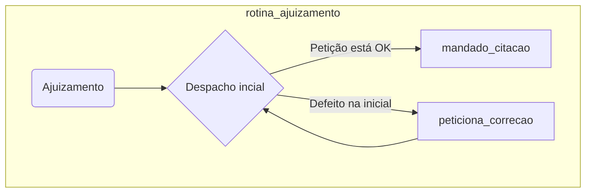

```mermaid
flowchart TD


subgraph rotina_ajuizamento
  ajuizamento(Ajuizamento)
  ajuizamento(Ajuizamento) -->despacho_inicial{Despacho incial}
  despacho_inicial --> |Petição está OK| mandado_citacao
  despacho_inicial --> |Defeito na inicial| peticiona_correcao 
  peticiona_correcao --> despacho_inicial
end

```