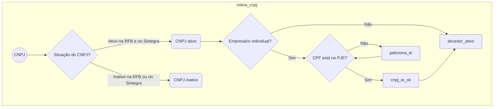

```mermaid
flowchart TD

subgraph rotina_cnpj
  devedor_cnpj((CNPJ)) -->  verifica_situacao_cnpj{Situação do CNPJ?}
  verifica_situacao_cnpj --> |Ativo na RFB e no Sintegra| cnpj_ativo(CNPJ ativo)
  verifica_situacao_cnpj --> |Inativo na RFB ou no Sintegra| cnpj_inativo(CNPJ inativo)
  cnpj_ativo --> verifica_ei{Empresário individual?}
  verifica_ei --> |Não| devedor_ativo
  verifica_ei --> |Sim| cnpj_ei_pje{CPF está no PJE?}
  cnpj_ei_pje --> |Sim| cnpj_ei_ok
  cnpj_ei_ok --> devedor_ativo
  cnpj_ei_pje --> |Não| peticiona_ei --> cnpj_ei_pje
end

```