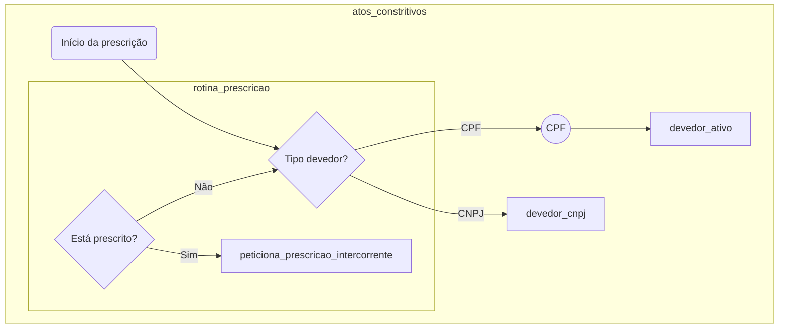

```mermaid
flowchart TD
subgraph atos_constritivos 
  inicio_prescricao(Início da prescrição) --> verifica_devedor{Tipo devedor?}
  verifica_devedor --> |CPF| devedor_cpf((CPF))
  devedor_cpf --> devedor_ativo
  verifica_devedor --> |CNPJ| devedor_cnpj
  subgraph rotina_prescricao
    verificar_prescricao{Está prescrito?}
    verificar_prescricao --> |Sim| peticiona_prescricao_intercorrente
    verificar_prescricao --> |Não| verifica_devedor
  end
end
```