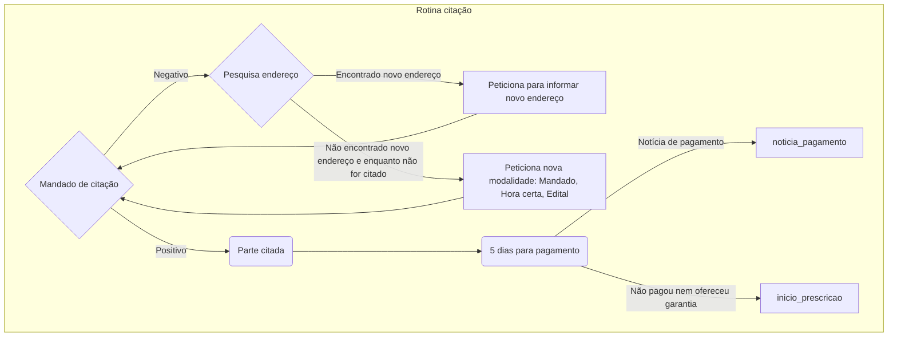

```mermaid
flowchart TD

subgraph rotina_citacao[Rotina citação]
  mandado_citacao{Mandado de citação}
  mandado_citacao --> |Positivo| parte_citada(Parte citada)
  mandado_citacao --> |Negativo| pesquisa_endereco{Pesquisa endereço}
  pesquisa_endereco --> |Encontrado novo endereço| peticiona_novo_endereco[Peticiona para informar novo endereço]
  peticiona_novo_endereco --> mandado_citacao
petiona_nova_modalidade[Peticiona nova modalidade: Mandado, Hora certa, Edital]
  pesquisa_endereco --> |Não encontrado novo endereço e enquanto não for citado| petiona_nova_modalidade
  petiona_nova_modalidade --> mandado_citacao
  parte_citada --> prazo_para_pagamento(5 dias para pagamento)
  prazo_para_pagamento --> |Notícia de pagamento| noticia_pagamento
  prazo_para_pagamento --> |Não pagou nem ofereceu garantia| inicio_prescricao
end
```