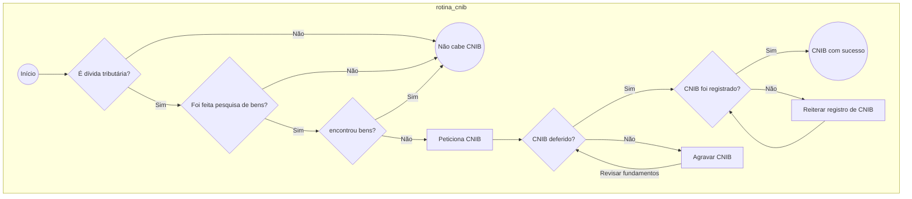

```mermaid
flowchart TD

inicio_cnib(("Início"))
cnib_sucesso((CNIB com sucesso)) 
nao_cabe_cnib((Não cabe CNIB))


subgraph rotina_cnib
  inicio_cnib --> e_tributaria
  e_tributaria{"É dívida tributária?"} --> |"Sim"| fez_pesquisas
  e_tributaria --> |"Não"| nao_cabe_cnib
  fez_pesquisas{"Foi feita pesquisa de bens?"} --> |"Sim"| encontrou_bens
  fez_pesquisas --> |"Não"| nao_cabe_cnib
  encontrou_bens{"encontrou bens?"} --> |"Não"| peticiona_cnib
  encontrou_bens --> |"Sim"| nao_cabe_cnib
  peticiona_cnib["Peticiona CNIB"] --> cnib_deferido
  cnib_deferido{"CNIB deferido?"}--> |"Sim"| cnib_registrado
  cnib_registrado{"CNIB foi registrado?"}--> |"Sim"| cnib_sucesso
  cnib_registrado{"CNIB foi registrado?"}--> |"Não"| reiterar_pedido_cnib
  reiterar_pedido_cnib["Reiterar registro de CNIB"] --> cnib_registrado
  cnib_deferido{"CNIB deferido?"}--> |"Não"| agravar_cnib
  agravar_cnib["Agravar CNIB"] -->|"Revisar fundamentos"| cnib_deferido
end
```