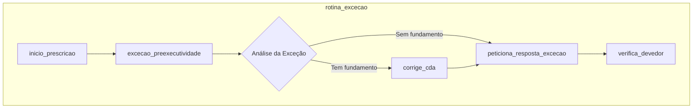

```mermaid
flowchart TD


subgraph rotina_excecao
  inicio_prescricao --> excecao_preexecutividade
  excecao_preexecutividade --> analise_de_excecao{Análise da Exceção}
  analise_de_excecao --> |Tem fundamento| corrige_cda
  analise_de_excecao --> |Sem fundamento| peticiona_resposta_excecao
  corrige_cda --> peticiona_resposta_excecao
  peticiona_resposta_excecao --> verifica_devedor
end
```