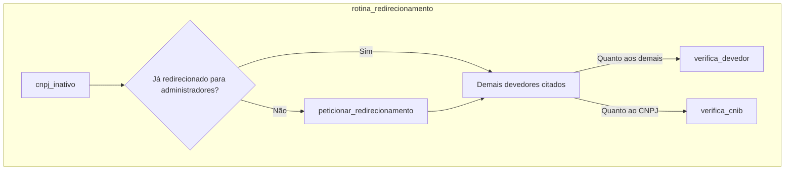

```mermaid
flowchart TD
subgraph rotina_redirecionamento
  cnpj_inativo -->  verificar_redirecionamentos{Já redirecionado para administradores?}
  verificar_redirecionamentos --> |Sim| demais_devedores_citados[Demais devedores citados]
  verificar_redirecionamentos --> |Não| peticionar_redirecionamento
  peticionar_redirecionamento  --> demais_devedores_citados
  demais_devedores_citados --> |Quanto aos demais| verifica_devedor
  demais_devedores_citados --> |Quanto ao CNPJ| verifica_cnib
end
```