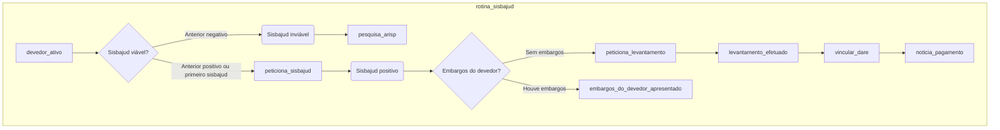

```mermaid
flowchart TD


subgraph rotina_sisbajud
  devedor_ativo -->  verifica_viabilidade_sisbajud{Sisbajud viável?}
  verifica_viabilidade_sisbajud --> |Anterior positivo ou primeiro sisbajud| peticiona_sisbajud
  verifica_viabilidade_sisbajud --> |Anterior negativo| sisbajud_inviavel(Sisbajud inviável)
  sisbajud_inviavel --> pesquisa_arisp
  peticiona_sisbajud --> sisbajud_positivo(Sisbajud positivo)
  sisbajud_positivo --> prazo_embargos{Embargos do devedor?}
  prazo_embargos --> | Sem embargos | peticiona_levantamento --> levantamento_efetuado
  levantamento_efetuado --> vincular_dare
  vincular_dare --> noticia_pagamento
  prazo_embargos --> | Houve embargos | embargos_do_devedor_apresentado
end
```