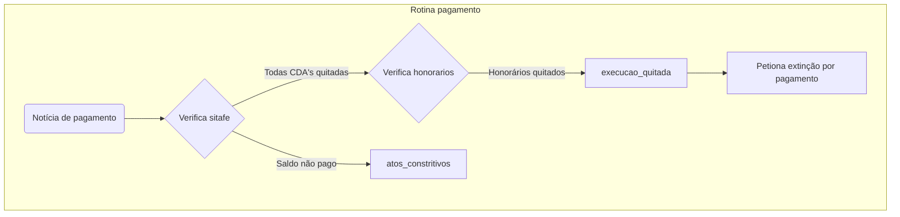

# Rotina Pagamento

```mermaid
flowchart TD

subgraph rotina_pagamento[Rotina pagamento]
  noticia_pagamento(Notícia de pagamento) --> verifica_sitafe{Verifica sitafe}
  verifica_sitafe --> |Todas CDA's quitadas| verifica_honorarios{Verifica honorarios}
  verifica_sitafe --> |Saldo não pago| atos_constritivos
  verifica_honorarios --> |Honorários quitados| execucao_quitada
  execucao_quitada --> peticiona_extincao_por_pagamento[Petiona extinção por pagamento]
end
```
